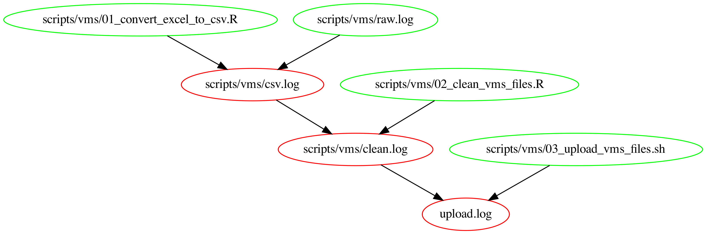

# Mexican Fisheries Data

Latest release: [](https://doi.org/10.5281/zenodo.15733839)
Cite all versions? You can cite all versions by using the DOI 10.5281/zenodo.10641018. This DOI represents all versions, and will always resolve to the latest one.

This repository contains the code to clean and maintain what I call the `Mexican fisheries data` set. This data set contains tables on Mexico's Vessel Monitoring System (VMS) tracking data, a vessel registry, landings data, and some other things. Data themselves are NOT archived in the repository due to GitHub's size constraints. I am using [`git-lfs`](https://git-lfs.com/), which you will have to install if you want to clone or fork the repository.

**I am more than happy to share any and all these data and see them put to a good use**. If you want to come up with a way of automating the delivery of the data, please reach out to me. I simply don't have the time.

Please submit an issue or send me an email if you encounter any issues. 

## 1) Mexican VMS data (2007 - 2025 [partial])

### Raw sources

- [Datos abiertos](https://datos.gob.mx/busca/dataset/localizacion-y-monitoreo-satelital-de-embarcaciones-pesqueras): These data are collected and curated by Mexico's [`SISMEP`](https://www.gob.mx/conapesca/acciones-y-programas/sistema-de-monitoreo-satelital-de-embarcaciones-pesqueras) (Sistema de Monitoreo Satelital de Embarcaciones Pesqueras). It reports the geolocation and timestamp of mexican fishing vessels that comply with [Mexico's fisheries regulation](https://www.dof.gob.mx/nota_detalle.php?codigo=5399371&fecha=03/07/2015#gsc.tab=0) on the matter. Simply put, vessels larger than 10.5m in length overall, with an on-board engine > 80hp, and with a roof must carry a transponder.

### "Clean" data vailability, with two different levels of processing

- L1 data (not recommended): Monthly CSV files are available in the `data/mex_vms/clean/` and on Google Cloud storage at: `gs://mex_fisheries/MEX_VMS/*`
- L1 and L2 data (recommended): On Google BigQuery at: `mex-fisheries.mex_vms.mex_vms_latest`, as a partitioned table (by year) and some level of processing with added features.

Note that BigQuery data use a standard versioning system every time the tables undergo a major change, like fixing bugs, adding data, or modifying the underlying cleaning code. Past versions include:

- `mex-fisheries.mex_vms.mex_vms_processed_v_20250623` <-- This is the current version, viewed by `mex-fisheries.mex_vms.mex_vms_latest`
- `mex-fisheries.mex_vms.mex_vms_processed_v_20250613`
- `mex-fisheries.mex_vms.mex_vms_processed_v_20250319`
- `mex-fisheries.mex_vms.mex_vms_processed_v_20240615`
- `mex-fisheries.mex_vms.mex_vms_processed_v_20240515`

You should be able to access the entire date set using BigQuery (SQL) or R. The following code snippet shows how you might connect to the database:

```
# Load packages ----------------------------------------------------------------
pacman::p_load(
  bigrquery,
  DBI,
  tidyverse
)

bq_auth("juancarlos.villader@gmail.com") # You'll need to authenticate using your own email

# Establish a connection -------------------------------------------------------
con <- dbConnect(bigquery(),
                 project = "mex-fisheries", # This is the name of the project, leave it as-is
                 dataset = "mex_vms",       # This is the name of the dataset, leave it as-is
                 billing = "your-billing-id-here", # And this is the blling. You will need to use yours here.
                 use_legacy_sql = FALSE, 
                 allowLargeResults = TRUE)
  
mex_vms <- tbl(con, "mex_vms_processed_latest") # This object now contains a tbl that points at mex_vms_processed_v_20250319

# That's it, you can now use dplyr verbs to work with the data.
# For example, get latitude, longitude, and vessel id for the first 1000 rows in the data
mex_vms |> 
    select(vessel_rnpa, lat, lon) |> 
    head(1000) |> 
    collect()
```

_NOTE: For details on the data cleaning, next steps, and know issues, see the dedicated [README](/scripts/mex_vms). File may not be up to date_

## 2) Vessel registry

### Raw data sources

- Data set shared by [CausaNatura](www.causanatura.org)

### "Clean" data availability

- On Google BigQuery at: `mex-fisheries.mex_vms.vessel_info_v_*`

## 3) Landings data [~2000-2025 (partial)]

### Raw data sources

- CONAPESCA Avisos (2000-2019) - No link, obtained offline. These contain landing receipts by economic unit and species between 2000 and 2019.
- [CONAPESCA](https://conapesca.gob.mx/wb/cona/avisos_arribo_cosecha_produccion) - These also contain landing receipts by economic unit and species, but between 2018 and present. A few years ago data were available as excel spreadsheets. Now they are available as CSV files.
- [datos_abiertos](https://datos.gob.mx/busca/dataset/produccion-pesquera) - These contain monthly fisheries production by "office", between 2006 and 2024

### "[Clean](data/mex_landings/clean)" data availability

I use the CONAPESCA Avisos (2000-2019) and CONAPESCA (2018-present) to build the data sets listed below. The pipeline is found under `scripts/mex_landings/`

#### Data by economic unit RNPA
- [annual](data/mex_landings/clean/mex_annual_landings_by_eu.rds)
- [monthly](data/mex_landings/clean/mex_monthly_landings_by_eu.rds)

#### Data by vessel RNPA
- [annual](data/mex_landings/clean/mex_annual_landings_by_vessel.rds)
- [monthly](data/mex_landings/clean/mex_monthly_landings_by_vessel.rds)

## 4) Subsidy data (coming soon)

### Sources

### Availability

## 5) Mexican TURFs (coming soon, but see Ere's paper [here](https://journals.plos.org/plosone/article?id=10.1371/journal.pone.0286739))

### Sources

### Availability

## 6) Misc spatial features

### Sources

- [Sea: Global Oceans and Seas](https://www.marineregions.org/sources.php)
- [EEZ: Marine and land zones: the union of world country boundaries and EEZ's](https://www.marineregions.org/sources.php)
- [Distance from shore](https://gmed.auckland.ac.nz/download.html)
- [Distance from port](https://gmed.auckland.ac.nz/download.html)
- [Depth](https://gmed.auckland.ac.nz/download.html)

## How do all these pieces come together?

There is a [Makefile](Makefile) outlining dependencies and order of operations, and the DAG is shown here:


